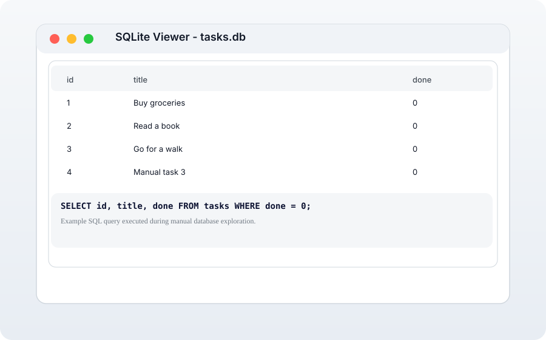

# Tasks SQLite App

## Overview
This project is a simple application that utilizes a SQLite database to manage tasks. It creates a database named `tasks.db` and a table called `tasks` to store task information.

## Database Schema
The `tasks` table consists of the following columns:
- **id**: An integer that serves as the primary key for each task.
- **title**: A string that represents the title of the task.
- **done**: A boolean that indicates whether the task is completed.

## Example Tasks
Upon the first run of the application, three example tasks will be inserted into the database if the `tasks` table is empty. The example tasks are:
1. Title: "Buy groceries", Done: false
2. Title: "Read a book", Done: false
3. Title: "Go for a walk", Done: false

## Getting Started

### Why SQLite
SQLite was chosen because it is a lightweight, serverless database that works well for a small task-tracking API. It requires no separate database server, stores data in a single file, and makes the project easy to run for anyone cloning the repository.

### Where the database file is stored
The database file is stored in the project root as `tasks.db`. The application creates this file automatically the first time it runs.

### Prerequisites
- Node.js installed on your machine.
- npm (Node Package Manager) which comes with Node.js.

### Installation
1. Clone the repository or download the project files.
2. Navigate to the project directory in your terminal.
3. Run the following command to install the required dependencies:
   ```
   npm install
   ```

### Running the Application
To start the application, use the following command:
```bash
npm start
```

This will start the Express server, create `tasks.db` automatically if it does not exist, create the `tasks` table, and make the API available at `http://localhost:3000/`.

### Database viewer screenshot


### Example SQL query
I executed a query like this while exploring the database:
```sql
SELECT id, title, done FROM tasks WHERE done = 0;
```

## License
This project is licensed under the MIT License.